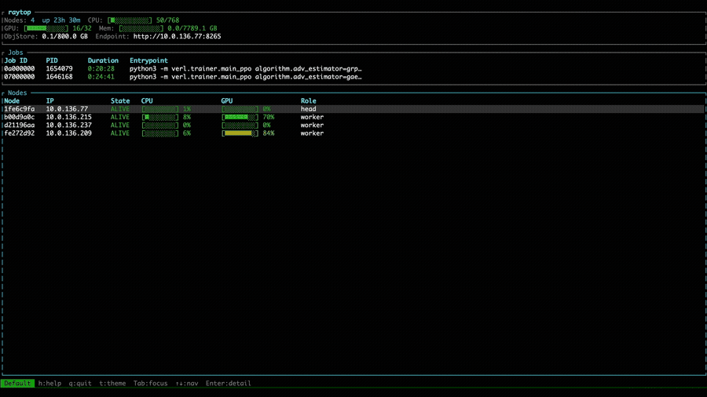

# raytop

[](https://crates.io/crates/raytop)
[](LICENSE)

A real-time TUI monitor for Ray clusters — like htop for distributed GPU training.

<p align="center">
  
</p>

`raytop` provides a unified view of cluster-wide resource utilization — including
CPU, GPU, and memory — as well as per-node breakdowns, per-GPU utilization via
Prometheus metrics, running job status, and live actor counts. All data is
retrieved from the Ray dashboard API and rendered in a continuously updating
display, similar in spirit to `htop` but tailored for multi-node GPU clusters.

## Install

Install from [crates.io](https://crates.io/crates/raytop):

```bash
cargo install raytop
```

## Usage

Point `raytop` at your Ray dashboard endpoint. The dashboard is typically
available on port 8265 of the Ray head node.

```bash
raytop --master http://<HEAD_IP>:8265
```

Use `j`/`k` or arrow keys to navigate nodes, `Enter` to open the detail panel,
`Tab` to switch focus between jobs and nodes, `t` to cycle themes, and `q` to quit.

## Build from Source

```bash
make build   # cargo build --release
make install # cargo install --path .
make fmt     # cargo fmt
make clean   # cargo clean
```

## Launch Ray Cluster

The included sbatch script provisions a Ray cluster inside Docker containers
across Slurm-managed nodes. It starts a Ray head process on the first allocated
node and Ray worker processes on all remaining nodes, then polls until every node
has successfully registered with the cluster. Once the cluster is fully formed,
the script exits while the detached containers continue running.

```bash
salloc -N 2 bash examples/ray/ray.sbatch
# or
sbatch -N 2 examples/ray/ray.sbatch
```

To use a custom container image (either a local tarball or a registry reference):

```bash
sbatch -N 4 examples/ray/ray.sbatch --image /fsx/ray+latest.tar.gz
```

## Examples

- [verl Training](examples/verl/) — PPO/GRPO training on a Ray cluster
- [Megatron Pretrain](examples/megatron/) — DeepSeek-V2-Lite pretrain with Megatron Bridge

## How It Works

1. **Cluster status** — REST API (`/api/cluster_status`) for cluster-wide CPU/GPU/memory allocation
2. **Node discovery** — REST API (`/api/v0/nodes`) for per-node info and state
3. **Per-GPU metrics** — Prometheus scraping (`/api/prometheus/sd`) for real-time GPU utilization, GRAM usage
4. **Jobs & actors** — REST API (`/api/jobs/`, `/api/v0/actors`) for running jobs and actor counts per node
5. **Async** — Background `tokio` task fetches all data in parallel, TUI never blocks

## License

Apache-2.0
